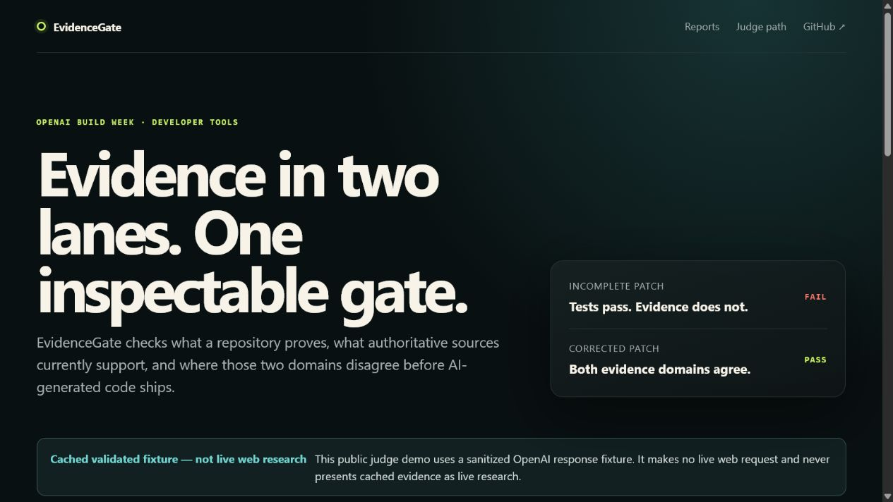
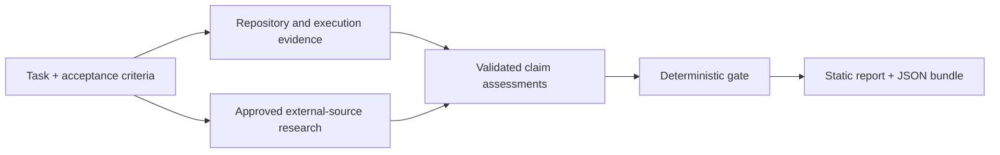

# EvidenceGate

## Tagline

> Code evidence, source evidence, and a release decision you can inspect.

EvidenceGate is a local-first developer tool for evaluating a change against acceptance criteria using two deliberately separate evidence domains: what the repository and its executed checks demonstrate, and what authoritative external sources currently state. It is targeting the Developer Tools track of [OpenAI Build Week](https://openai.com/build-week/); the [submission draft](docs/DEVPOST_SUBMISSION_DRAFT.md) and status are tracked separately and do not imply submission.

## Try the judge demo without installing

Open the [hosted Fail-to-Pass judge demo](https://harsh-choksi.github.io/EvidenceGate/). It publishes two sanitized, self-contained cached reports and their verifiable JSON bundles. No account, API key, installation, or source rebuild is required. The page and reports label the fixture as cached; they never present it as live web research.



## Demo report teaser

The packaged demo compares a plausible but incomplete sourced-answer patch with a corrected patch. This text preview mirrors the report's two-lane structure; the hosted demo above contains the actual generated reports.

```text
Criterion: Display every web-derived citation as a visible, clickable link

                         INCOMPLETE PATCH        CORRECTED PATCH
Repository evidence      unsupported             verified
External source evidence supported               supported
Combined hybrid result   FAIL                    PASS

Why the first run fails: documentation proves the requirement, not its implementation.
```

`pnpm demo` generates the actual self-contained HTML reports and JSON evidence bundles, then prints their locations.

## Problem

AI-generated changes can look complete while omitting an acceptance criterion, testing only a happy path, using an outdated API, or citing a source that does not support the claim. Tests, static analysis, documentation search, and AI review each cover only part of that problem. A model's statement that a change is complete is not release evidence.

## Dual-evidence solution

EvidenceGate turns task criteria into inspectable claims, captures bounded repository and command evidence, optionally researches approved external claims, validates source provenance and citations, and applies a deterministic gate policy. The live demo path uses GPT-5.6 Terra first for bounded external research and then for structured evidence adjudication; policy code independently recomputes the release result.



## Internal versus external evidence

| Evidence domain | Question it answers                                            | Examples                                                                              | Cannot prove                                               |
| --------------- | -------------------------------------------------------------- | ------------------------------------------------------------------------------------- | ---------------------------------------------------------- |
| Internal        | What does this repository and its executed checks demonstrate? | Git diff, source, tests, lint, typecheck, build, runtime probes                       | That an external API, standard, or policy is still current |
| External        | What do allowed authoritative sources currently state?         | Official documentation, standards, release notes, registries, government publications | That this repository implements the stated requirement     |

The boundary is non-negotiable: an official API page cannot substitute for implementation evidence, and matching method names in source code cannot establish that an API is current.

## Hybrid claim example

> The application uses the current OpenAI web-search interface and displays every cited source as a visible clickable citation.

External evidence must establish the current interface and citation-display requirement. Internal evidence must establish the `web_search` request, returned-source handling, annotation parsing, URL/source-ID validation, rendering, and tests. A required hybrid claim passes only when internal status is `verified` **and** external status is `supported`.

## Quick start

Prerequisites: Git and Node.js 20.12 or newer. This repository pins pnpm 11.9.0 through `packageManager`. The runtime target is Windows, macOS, and Linux; clean-platform verification results are recorded only after they are run.

```powershell
Set-Location EvidenceGate
npx.cmd --yes pnpm@11.9.0 install --frozen-lockfile
npx.cmd --yes pnpm@11.9.0 demo
```

On macOS or Linux, use the same commands with `cd EvidenceGate` and `npx` in place of `Set-Location` and `npx.cmd`. This non-admin path does not run `corepack enable` or write into the Node.js installation directory. Clone the repository using the URL supplied with the submission before running these commands. The cached demo is the default judge-friendly path and makes no network request.

## One-command demo

```powershell
npx.cmd --yes pnpm@11.9.0 demo
```

The deterministic demo uses sanitized cached OpenAI response fixtures, labels them as cached, evaluates the incomplete and corrected patches, generates Fail and Pass reports, and prints the output paths. It writes each scenario to `.evidencegate/demo/<scenario>/report.html` and `.evidencegate/demo/<scenario>/evidence-bundle.json`. Cached fixtures are reproducibility aids, not live research. `pnpm pages:build` packages the same verified outputs as the static GitHub Pages judge site and refuses artifacts containing secret-shaped values, local file URLs, or cross-platform user/runner paths.

For a clean PDF export, disable the browser print dialog's **Headers and footers** option. Otherwise Chrome adds the local `file:///` report path and machine username to every page. Inspect the preview for orphaned headings or a footer-only final page before publishing it.

## Live source-check setup

Live mode is explicit and opt-in:

```powershell
Copy-Item .env.example .env
# Add OPENAI_API_KEY to .env or set it in your shell.
npx.cmd --yes pnpm@11.9.0 demo:live
```

On macOS or Linux, use `cp .env.example .env` and `npx --yes pnpm@11.9.0 demo:live`. Live mode first makes one shared GPT-5.6 Terra web-search request. If that response lacks current, official, native-cited canonical-guide coverage for domain filtering, consulted-source metadata, URL citation annotations, and visible/clickable citation presentation, EvidenceGate permits exactly one focused Web Search follow-up shared by both scenarios; it never researches until the gate passes. The resulting source corpus then receives one strict structured-output adjudication for each of the incomplete and corrected scenarios. Each research request has a 90-second bound. A retryable local adjudication-validation failure permits one correction attempt with the same bounded/redacted evidence and no tools; every completed or rejected attempt is recorded separately, and each scenario's initial adjudication plus possible correction share a 90-second bound. The demo therefore makes three or four API calls normally and at most six when the focused research pass runs and both adjudications need correction.

Live bundles and reports are written beneath `.evidencegate/demo/live/<scenario>/`, separately from cached artifacts. If the expected Fail-to-Pass invariant is not met, the command reports the gate summary, non-passing criteria, reason codes, and both artifact paths for inspection.

The packaged live demonstration deliberately configures no maximum source age for its canonical official-documentation query because returned web-search metadata may omit publication/update dates. That explicit policy makes freshness non-restrictive; it does not manufacture a date, and retrieval/provenance remain recorded. Cached mode retains its 30-day policy. The final exact-runtime-head Terra check completed the live Fail-to-Pass invariant in one research pass on 2026-07-21; its verified bundle hashes are recorded in [implementation status](docs/IMPLEMENTATION_STATUS.md).

## OpenAI API configuration

`OPENAI_API_KEY` is required only for live research and adjudication. `EVIDENCEGATE_OPENAI_MODEL` defaults to `gpt-5.6-terra` and lets the packaged live demo use another compatible model without allowing research and adjudication metadata to drift. `RUN_LIVE_OPENAI_TESTS=true` is also required for opt-in live tests, and `RUN_LIVE_OPENAI_ADJUDICATION=true` is required when constructing the adjudicator directly; the explicit `demo:live` command supplies its own opt-in. Ordinary tests and CI use sanitized fixtures. Product identity is configurable through `EVIDENCEGATE_PRODUCT_NAME` and `EVIDENCEGATE_TAGLINE`.

For least privilege, use a dedicated OpenAI Project and a **Restricted** project key. Allow `Model capabilities: Request` and `Responses API: Write`, enable `gpt-5.6-terra` in project Model Usage, and leave List models, Assistants, Threads, Files, Vector Stores, Prompts, Batch, Evals, Fine-tuning, Videos, and other unused resources at `None`. Web search runs inside the Responses request and does not require a separate published key permission. Never commit the key or add it to ordinary CI; revoke a temporary release-verification key after the live run.

The default model is [`gpt-5.6-terra`](https://developers.openai.com/api/docs/models/gpt-5.6-terra). The live adapter uses the [Responses API](https://developers.openai.com/api/docs/guides/migrate-to-responses), the [`web_search` tool](https://developers.openai.com/api/docs/guides/tools-web-search), domain filters, and `include: ["web_search_call.action.sources"]`. See [OpenAI integration](docs/OPENAI_INTEGRATION.md) for the trust boundary and response-validation flow.

## CLI commands

From a Windows source checkout, run CLI commands as `npx.cmd --yes pnpm@11.9.0 evidencegate <command>`; use `npx` instead of `npx.cmd` on macOS or Linux:

| Command                                                            | Purpose                                                                                      |
| ------------------------------------------------------------------ | -------------------------------------------------------------------------------------------- |
| `init`                                                             | Create starter local configuration                                                           |
| `doctor`                                                           | Check the runtime, repository, configuration, and live prerequisites                         |
| `task new`                                                         | Create a task specification                                                                  |
| `task validate <file>`                                             | Validate a task at the trust boundary                                                        |
| `capture`                                                          | Capture a bounded Git comparison                                                             |
| `sources plan`                                                     | Build a bounded source-search plan                                                           |
| `sources preview`                                                  | Show queries, domains, freshness, and privacy warnings before research                       |
| `sources check --approve [--criterion <ids...>]`                   | Execute an explicitly approved live source check                                             |
| `sources list`                                                     | List validated source-registry records                                                       |
| `sources inspect <source-id>`                                      | Inspect one source and its citation bindings                                                 |
| `analyze [--sources=<mode>] [--source-results <file>] [--preview]` | Capture Git/check evidence, consume an approved source artifact, and write a verified bundle |
| `gate`                                                             | Apply the deterministic release policy                                                       |
| `report`                                                           | Generate a self-contained HTML report                                                        |
| `verify <bundle.json>`                                             | Revalidate references and the canonical bundle hash                                          |
| `demo`                                                             | Run the packaged demo workflow                                                               |
| `version`                                                          | Print the EvidenceGate version                                                               |

The current `analyze --sources` intents are `requested` and `required`. Tasks in `requested` source mode also require an explicit `--criterion` selection before `sources check` can make a network call. The root scripts are `demo`, `demo:live`, and `verify`. Run `npx.cmd --yes pnpm@11.9.0 evidencegate --help` for the implemented options.

## Source policies

Research is controlled by both a source mode and an authority policy. The default mode is `requested`; live access is never implied by claim classification alone.

| Source mode                     | Network behavior                                                           |
| ------------------------------- | -------------------------------------------------------------------------- |
| `off`                           | Never search                                                               |
| `requested`                     | Search only user-selected claims                                           |
| `required`                      | Require valid external evidence for claims that need authority             |
| `automatic_for_external_claims` | Propose plans for external/hybrid claims and require approval before calls |

Available authority policies are `official_only`, `primary_sources`, `standards_bodies`, `vendor_documentation`, `maintainer_sources`, `peer_reviewed`, `government_sources`, `reputable_broad`, and `custom`. They enforce source types, exact/subdomain rules, blocked domains, minimum counts, and freshness in code rather than prompt text. See [source policies](docs/SOURCE_POLICIES.md).

## Citation integrity

A citation is accepted only when it binds to a source returned in the same research provenance. EvidenceGate parses native `url_citation` annotations, validates ranges, maps URLs to the returned source registry, rejects invented IDs, permits only HTTP(S), enforces domain policy locally, and escapes source-derived report content. OpenAI's web-search guide requires web-derived inline citations shown to users to be visible and clickable; the static report preserves both properties.

Persisted source-results artifacts are bound to the exact task, configuration, and canonical approved-plan subset plus a hash over the complete payload. Consumption revalidates canonical source IDs, URLs/domains, native citation text/ranges, run metadata, authority, freshness, source policy, and criterion-specific cited-text relevance, including when an already parsed object is passed directly to the workflow.

See [citation integrity](docs/CITATION_INTEGRITY.md) for failure behavior and negative-test cases.

## Architecture

The TypeScript workspace keeps provider and presentation concerns outside the deterministic core:

```text
apps/cli                  command routing and exit behavior
packages/core             schemas, assessments, gate, bundle/hash contracts
packages/git              repository detection and bounded diff capture
packages/runner           bounded configured-command execution and redaction
packages/analyzers        deterministic repository evidence rules
packages/source-research  plans, policies, OpenAI adapter, registry, citations
packages/openai           strict GPT-5.6 structured evidence adjudication
packages/workflow         end-to-end capture, source, assessment, and gate orchestration
packages/config           strict local configuration
packages/report           self-contained, escaped static HTML
fixtures                  sanitized demos and adversarial cases
```

Validated data flows from the internal and external planes into the decision plane. See [architecture](docs/ARCHITECTURE.md), [evidence model](docs/EVIDENCE_MODEL.md), and [gate policy](docs/GATE_POLICY.md).

## Security

Repository files, command output, model output, and retrieved web content are all untrusted. Controls include schema validation, known-ID checks, bounded output, secret redaction, explicit research approval, exact hostname matching, blocked-domain precedence, unsafe-URL rejection, HTML escaping, and deterministic policy. Configured commands are trusted operator input and can execute code; review configuration before running EvidenceGate on an untrusted repository.

Read [security guidance](docs/SECURITY.md) and the [threat model](docs/THREAT_MODEL.md). EvidenceGate is not a security certification or a sandbox.

## Privacy

Offline workflows remain local. Live research sends only the approved, redacted source query and tool configuration to OpenAI; repository code is excluded from source-only queries by default. Reports and bundles are written locally, full web pages are not stored by default, and cached fixtures are clearly labeled. Review the search preview before approving any network request.

See [privacy](docs/PRIVACY.md) and OpenAI's current [API data controls documentation](https://developers.openai.com/api/docs/guides/your-data).

## Limitations

EvidenceGate provides bounded evidence, not formal verification. Static rules can miss semantics, tests can be incomplete, source authority and freshness require judgment, redirects cannot be fully assessed without retrieval, and generated reports can contain sensitive repository evidence if you include it. High-stakes legal, security, medical, or compliance claims require qualified human review. Passing the gate does not mean bug-free, secure, or universally compliant software.

The MVP is local-first, TypeScript-focused, and uses one live research provider. It does not host accounts, merge changes, certify compliance, or replace code review. See [next steps](docs/NEXT_STEPS.md) for deliberately unfinished work.

## How Codex was used

Codex served as the primary build collaborator for requirements decomposition, architecture, TypeScript implementation, tests, adversarial fixtures, security review, documentation, and demo preparation. Human decisions retained the evidence boundary, source authority rules, scope, and final-submission control. Codex's own completion statements are never evidence for the gate. The dated record is in [Codex usage](docs/CODEX_USAGE.md); the primary `/feedback` Session ID remains pending until actually captured.

## How GPT-5.6 is used

GPT-5.6 has two bounded live roles. Stage A uses web search to produce a cited narrative and returned-source provenance. After local URL, domain, freshness, and citation validation, Stage B receives only bounded, redacted criteria, domain-specific internal/external claim facets, evidence summaries, source metadata, and source-bound narrative context derived from native annotations. The narrative remains untrusted model text and never substitutes for source provenance. Stage B returns strict JSON-schema assessments referencing supplied IDs. Local validation rejects missing coverage, invented or cross-bound IDs, unsafe or stale support, malformed output, refusals, and model-supplied combined statuses that violate the shared deterministic reducer. Policy code then recomputes the gate independently. GPT-5.6 cannot change source policy or approve release. The cached demo remains deterministic and makes no network or model call. The successful 2026-07-18 live Fail-to-Pass run used the historical `gpt-5.6` Sol alias; current live defaults use `gpt-5.6-terra`, whose catalog entry documents Responses API, structured-output, and web-search support: [GPT-5.6 Terra](https://developers.openai.com/api/docs/models/gpt-5.6-terra). Terra's separate live source test, bounded two-pass recovery run, and final one-pass packaged run at runtime commit `e54e855` have all passed. The final tag, recording, and human submission review remain separate release steps.

## How OpenAI web search is used

For an approved external or hybrid claim, EvidenceGate builds a minimal search plan, shows what will leave the machine, and calls the Responses API with `tools: [{ type: "web_search", ... }]`. Provider-side allowed domains narrow retrieval; local URL, domain, freshness, and provenance validation remains authoritative. Returned `web_search_call` source records and native annotations are retained so every report link can be traced to the response that supplied it.

Official references: [Responses API migration guide](https://developers.openai.com/api/docs/guides/migrate-to-responses), [web-search guide](https://developers.openai.com/api/docs/guides/tools-web-search), and [Structured Outputs guide](https://developers.openai.com/api/docs/guides/structured-outputs).

## Testing

Run the full offline verification suite:

```powershell
npx.cmd --yes pnpm@11.9.0 verify
```

The `verify` script checks formatting, builds the workspace declarations needed by type-aware tooling, then runs lint, strict typechecking, and tests. The standalone `lint` and `typecheck` commands perform the same build bootstrap so they also work immediately after a clean install. Use `npx` instead of `npx.cmd` on macOS or Linux. Tests cover schemas, hybrid gate logic, forged gate decisions, URL/domain rules, fabricated citations, invalid ranges, stale/conflicting sources, redaction, structured-output coverage and ID binding, prompt injection, bounded commands, Git parsing, and report escaping/link safety. The `demo` script separately asserts the cached Fail-to-Pass invariant. Live tests remain behind explicit environment opt-ins; they are not part of ordinary CI.

Verified command results belong in [implementation status](docs/IMPLEMENTATION_STATUS.md). Do not infer a green build from this README.

## License

EvidenceGate is available under the [MIT License](LICENSE). The name and tagline are project identifiers, not assertions of trademark availability or rights.
