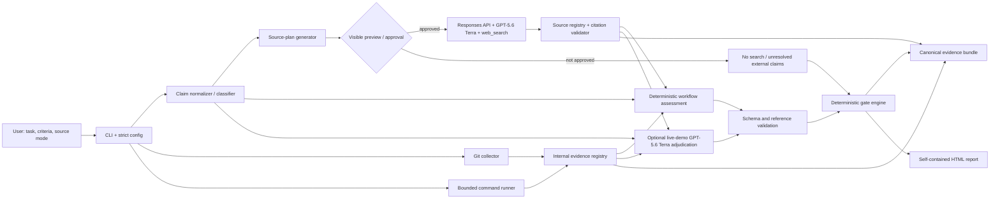

# EvidenceGate architecture

This document describes the implemented MVP architecture and its trust boundaries. See [IMPLEMENTATION_STATUS.md](IMPLEMENTATION_STATUS.md) for the exact commands and environments that have been verified.

## Architectural thesis

EvidenceGate has three planes that meet only through validated, versioned data:

1. **Internal evidence plane:** Git state, source, and executed repository checks.
2. **External evidence plane:** approved research plans, OpenAI web search, returned source metadata, citations, authority, freshness, and conflicts.
3. **Decision plane:** schema-valid assessments and a deterministic gate policy.

An external source can establish what should be true; it cannot prove that the code makes it true. Conversely, code can demonstrate behavior without proving that an external API assumption is current.

## Trust boundaries

| Boundary          | Untrusted input                                 | Required controls                                                                                              |
| ----------------- | ----------------------------------------------- | -------------------------------------------------------------------------------------------------------------- |
| Repository        | Files, comments, commits, tests, command output | Treat as quoted data; path allow/exclude rules; secret redaction; size/output limits; no embedded instructions |
| Process execution | Configured commands and their output            | Explicit command config, timeout, bounded capture, exit metadata, no shell construction from model text        |
| External network  | Queries and OpenAI responses                    | Visible plan, user/source-mode authorization, minimal query data, API-key isolation, retry limits              |
| Web content       | Pages, snippets, titles, URLs                   | Evidence-not-instructions prompt, domain/scheme validation, escaping, source authority rules                   |
| Model output      | Classifications, narratives, assessments, IDs   | Strict schema parsing, known-ID validation, bounded text, no direct policy mutation or release approval        |
| Report browser    | Source-derived strings and links                | HTML escaping, HTTP(S) allowlist, safe link attributes, no remote scripts or embedded source HTML              |

## Optional live-demo two-stage model pipeline

The generic CLI workflow constructs bounded assessments deterministically from Git/check evidence, configured verification hints, and an approved source-results artifact. The opt-in live demo additionally exercises the following two-stage model path.

### Stage A: external research

Input is limited to the normalized external claim, approved queries, source policy, allowed/blocked domains, freshness, and version/date context. It normally excludes repository code. GPT-5.6 Terra uses `web_search`; the system retains the `web_search_call`, citation annotations, and requested complete source list. Output is a bounded cited narrative plus raw provenance for registry construction.

### Stage B: live-demo evidence adjudication

Input contains acceptance criteria, explicit internal/external facets for hybrid claims, internal evidence/check summaries, normalized source records, cited findings, bounded source-bound narrative contexts, explicit candidate criterion scopes, and known IDs. Projected facets remain atomic to their criterion and domain; one criterion cannot silently inherit another criterion's obligation. The narrative contexts are derived from validated annotation ranges but remain untrusted model-written hints; they do not replace structured source provenance. Web search and all other tools are off. The response must match a strict schema and may reference only eligible supplied evidence/source IDs. Local validation checks the model-supplied combined status with the same pure reducer used by the final gate. A retryable local validation failure permits one correction request with the same bounded input and sanitized diagnostics; every successful-path attempt is retained as a distinct model-run record, and a second failure remains a hard failure.

This split limits code exposure, preserves native search provenance, and distinguishes `source_error` from an implementation failure.

## Deterministic decision path

The gate is a pure policy evaluation over validated assessments and check results. GPT-5.6 may help map evidence to claims, but confidence is informational only. Core invariants:

- Required internal claim: `verified` or the criterion cannot pass.
- Required external claim: `supported` with policy-valid, sufficiently current evidence or the criterion cannot pass.
- Required hybrid claim: internal `verified` **and** external `supported`.
- Unmapped citations, invalid source references, or required research failures produce a source failure, not fabricated certainty.
- Authoritative conflicts and high-stakes ambiguity route to manual review.
- Required command failure and critical finding fail the gate.

Policy versions and the exact inputs used by the policy are stored in the bundle.

## Repository boundaries

| Area                       | Responsibility                                                                                              |
| -------------------------- | ----------------------------------------------------------------------------------------------------------- |
| `apps/cli`                 | Command routing, prompts/approval, human-readable terminal output, exit codes                               |
| `packages/core`            | Task, claim, evidence, finding, gate, bundle schemas; canonical hashing                                     |
| `packages/git`             | Repository detection, ref validation, diff capture, changed-file classification                             |
| `packages/runner`          | Safe bounded configured-command execution and result capture                                                |
| `packages/analyzers`       | Deterministic repository and check analyzers                                                                |
| `packages/source-research` | Search plans/policies, Stage-A web-search provider, registry, URL/domain/citation/freshness/conflict checks |
| `packages/openai`          | Strict Stage-B prompts, Responses API requests, structured-output validation, model metadata                |
| `packages/workflow`        | End-to-end capture, plan/artifact binding, assessment construction, and gate orchestration                  |
| `packages/report`          | Bundle-to-static-report generation                                                                          |
| `packages/config`          | Strict configuration and redaction                                                                          |
| `fixtures`                 | Sanitized offline source results, incomplete/corrected patches, attack and edge cases                       |

Dependencies point inward toward `core` contracts. The gate engine must not depend on CLI/UI, and provider-specific API shapes must be normalized before entering core policy.

## Data lifecycle

1. Parse and validate configuration/task; record base/head refs and source mode.
2. Normalize criteria and present classifications.
3. Capture bounded internal evidence and configured check results.
4. Generate source plans only for authorized external/hybrid claims; preview data leaving the machine.
5. Execute approved research, retain bounded provenance, and build the validated source registry.
6. Bind persisted source results to the exact task/configuration/canonical plan and revalidate the complete payload when consumed.
7. Construct deterministic generic-workflow assessments; in the live demo, run separate Stage-B adjudication and validate every referenced ID.
8. Apply the stored, versioned deterministic gate policy.
9. Canonically serialize and hash the bundle; generate static HTML from the same validated bundle.

Full web pages are not stored by default. Store bounded narratives, URLs, metadata, annotations, and hashes where available.

## Canonical bundle boundary

Canonicalization defines UTF-8 encoding, recursive key ordering, array ordering, and omission of `bundleHash` while hashing. Verification recomputes the hash, revalidates cross-layer assessment consistency, loads the exact stored gate-policy inputs for the declared policy version, and recomputes the complete gate decision before trusting the report.

## Deployment shape

The MVP is a local Node.js/TypeScript CLI with a generated static report. It requires no hosted account or database. Offline demo mode consumes checked-in sanitized fixtures; live mode requires `OPENAI_API_KEY` and an explicit opt-in. Ordinary CI stays offline.
