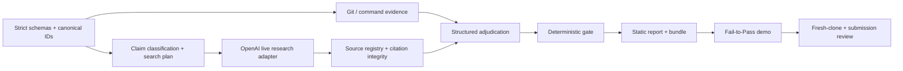

# EvidenceGate implementation plan

## Objective and priority

Ship the smallest complete dual-evidence developer tool that can reliably demonstrate an incomplete agent-generated patch failing, a corrected patch passing, and the authoritative sources behind the requirement remaining distinct from code/test proof.

Priority order:

1. Reliable Fail-to-Pass demonstration
2. Correct evidence-domain separation
3. Actual returned source metadata
4. Citation integrity
5. Deterministic gate
6. Clear static report
7. Security and privacy
8. Documentation and submission polish

Do not lead with a dashboard, GitHub integration, multiple research providers, hosted accounts, or generalized chat/research.

## Critical path

Cached provider fixtures should be created from a sanitized known-good response shape early so all downstream work remains testable offline. Live integration is then verified separately behind explicit opt-in.

## Phase plan

### Phase 0 — compliance and repository baseline

Deliver:

- official-rule snapshot, product/architecture/evidence/source/citation specifications, Codex usage log, and agent instructions;
- pnpm TypeScript workspace with strict compiler settings, formatting, lint, Vitest, build, and CI skeleton;
- environment/config examples with no secrets.

Exit criteria:

- clean install succeeds;
- lint, typecheck, tests, and build commands exist and pass;
- current hackathon requirements are documented and final recheck remains explicitly pending.

### Phase 1 — core contracts and bundle integrity

Deliver:

- task and acceptance-criterion schemas;
- claim classification, internal evidence, source/citation, assessment, finding, gate, research/model-run, and evidence-bundle schemas;
- stable ID helpers, referential validation, canonical serialization, and hashing;
- schema and tamper-detection tests.

Exit criteria:

- malformed tasks and duplicate/unknown IDs fail with deterministic errors;
- invented evidence/source references are rejected;
- identical semantic bundles hash identically under documented ordering rules;
- changing decision-relevant data breaks verification.

### Phase 2 — deterministic repository collection

Deliver:

- Git repository/ref detection and bounded diff capture;
- include/exclude path enforcement and changed-file classification;
- safe configured-command runner with timeout, bounded/redacted output, and exit metadata;
- test/build/lint/type-check evidence adapters.

Exit criteria:

- fixtures produce stable internal evidence;
- command failure, timeout, truncation, and redaction are visible;
- model or repository text cannot select an arbitrary shell command.

### Phase 3 — classification, source planning, and privacy preview

Deliver:

- internal/external/hybrid/subjective/unsupported classifier with user override provenance;
- source policy/domain/freshness configuration and strict validation;
- plan, preview, and approval flow;
- privacy/leakage detector for queries.

Exit criteria:

- internal-only claims do not trigger research;
- hybrid claims create bounded, appropriate plans;
- exact queries/domains/model/call estimate/data disclosure are visible;
- no network request occurs before source-mode authorization.

### Phase 4 — Responses API web search

Deliver:

- OpenAI client configured for `gpt-5.6`, Responses API, and `web_search`;
- provider-side allowed/blocked domains;
- `web_search_call`, complete requested sources, and `url_citation` extraction;
- research-run metadata and bounded retries;
- opt-in live smoke test.

Exit criteria:

- live official-domain research returns real sources and annotations;
- API key is absent from logs/bundles;
- ordinary CI requires no network or key;
- cached and live output are unmistakably labeled.

### Phase 5 — source and citation validation

Deliver:

- HTTP(S)-only URL parsing/normalization;
- exact/subdomain and redirect-destination enforcement;
- registry IDs, deduplication, annotation range/source binding;
- source type/authority, freshness, and conflict detection;
- fabricated-citation, look-alike-domain, stale/conflict, and prompt-injection fixtures.

Exit criteria:

- every citation maps to returned provenance;
- spoofed domains, unsafe schemes, unknown IDs, and bad ranges fail safely;
- stale sources are labeled and authoritative conflicts route to manual review.

### Phase 6 — two-stage GPT-5.6 adjudication

Deliver:

- bounded research and evidence-adjudication prompts with untrusted-content delimiters;
- strict structured output and known-ID validators;
- missing-evidence and contradiction analysis;
- model-run metadata without secrets or hidden reasoning.

Exit criteria:

- repository/web injection text cannot change policy or reveal secrets;
- invented evidence/source IDs invalidate the output;
- external research receives no code by default;
- model confidence has no release authority.

### Phase 7 — deterministic gate

Deliver:

- versioned internal, external, hybrid, command, severity, manual-review, source-error, and precedence rules;
- stable reason codes and CLI exit codes;
- truth-table and mixed-failure tests.

Exit criteria:

- external docs alone cannot pass implementation;
- code alone cannot pass required current external authority;
- every required hybrid claim needs internal `verified` and external `supported`;
- repeated evaluation of the same validated bundle yields the same gate.

### Phase 8 — static report and bundle verification

Deliver:

- combined gate, internal evidence, and external source views;
- criterion matrix and source cards;
- visible accessible citations, print-safe URLs, trust disclosure, policy/freshness/conflict details;
- bundle verifier and displayed hash.

Exit criteria:

- report opens without a backend or remote scripts;
- failing disagreement is understandable in 15 seconds;
- every displayed value originates in the validated bundle;
- tampering is detected.

### Phase 9 — demo and documentation

Deliver:

- `sourced-answer-demo` task, incomplete/corrected patches, cached research, attack fixtures, and expected assertions;
- `pnpm demo` deterministic offline flow and `pnpm demo:live` opt-in flow;
- README, screenshot, demo script, sample reports, supported platforms, install/test guidance, and Codex/GPT-5.6/web-search explanations.

Exit criteria:

- fresh clone completes the documented offline demo;
- incomplete result fails for the specified reasons and corrected result passes;
- live smoke path works when configured;
- no undocumented manual data editing is required.

### Phase 10 — release and submission

Deliver:

- security/license/secret review and release artifact;
- final under-three-minute public YouTube demo;
- Devpost description, repository/test URL, Developer Tools track, and primary `/feedback` Session ID;
- final official-rule/form review and user-approved submission fields.

Exit criteria:

- [SUBMISSION_CHECKLIST.md](SUBMISSION_CHECKLIST.md) is complete with evidence;
- user has reviewed every field and final video;
- submission is performed manually before the official deadline.

## Schedule

| Date                 | Required outcome                                                                                                     |
| -------------------- | -------------------------------------------------------------------------------------------------------------------- |
| July 18              | Phases 0–2 plus classification/search-plan foundation; repository knows what needs internal versus external evidence |
| July 19              | Live OpenAI adapter, citation/source validation, adjudication, and gate; incomplete patch fails correctly            |
| July 20              | Static report, corrected patch, one-command demo, security fixtures, README, and first video rehearsal               |
| July 21 morning      | Fresh-clone, live smoke, security/rule review, final video/upload, Devpost fields, primary Session ID                |
| July 21, 2:00 PM EDT | Internal submission target; no major feature work afterward                                                          |
| July 21, 8:00 PM EDT | Official deadline (5:00 PM PDT)                                                                                      |

## Test strategy

- **Unit:** schemas, classification, policies, exact host matching, URLs, citations, freshness, conflicts, hybrid truth table, canonical hashing.
- **Provider fixtures:** success, no result, blocked source, unknown ID, invalid range, duplicates, redirects, stale/conflicting pages, injection content.
- **Integration:** temporary Git fixtures and command outcomes without network.
- **End to end:** complete cached Fail-to-Pass flow and static report assertions.
- **Live smoke:** opt-in GPT-5.6/web-search/source/citation/domain behavior only; never ordinary CI.
- **Fresh clone:** judge-facing install and test path on each claimed supported platform.

## Risk controls

| Risk                              | Control / fallback                                                                                            |
| --------------------------------- | ------------------------------------------------------------------------------------------------------------- |
| API shape or model access changes | Provider adapter, official-doc recheck, captured sanitized fixture, explicit live preflight                   |
| Live search latency/flakiness     | Bounded retry/timeout; cached deterministic demo clearly labeled; record live sequence separately when stable |
| Citation/source mismatch          | Fail closed, native-annotation tests, complete source include, registry cross-reference validation            |
| Demo exceeds three minutes        | Script to 2:50, rehearse with timer, cut narration before product proof                                       |
| Judge cannot run project          | One-command cached demo, supported-platform statement, sample reports, fresh-clone rehearsal                  |
| Prompt injection or secret leak   | Untrusted-data boundaries, source-only queries, preview, redaction, fixture tests, log/bundle scan            |
| Scope creep                       | Freeze non-goals; one demo repository, one provider, one static report                                        |
| Documentation overstates progress | Status file uses verified evidence only; submission checklist remains unchecked until performed               |

## Definition of done

Done requires working task/claim schemas, real Git and check collection, visible approved research policy, GPT-5.6 Responses API web search, returned sources and annotation parsing, strict citation/domain/URL integrity, separate domain assessments, deterministic hybrid gate, static accessible report, verifiable bundle, safe injection fixtures, reliable incomplete/corrected demo, clean install, passing checks, no secrets, final compliance review, final video, and primary `/feedback` Session ID.
